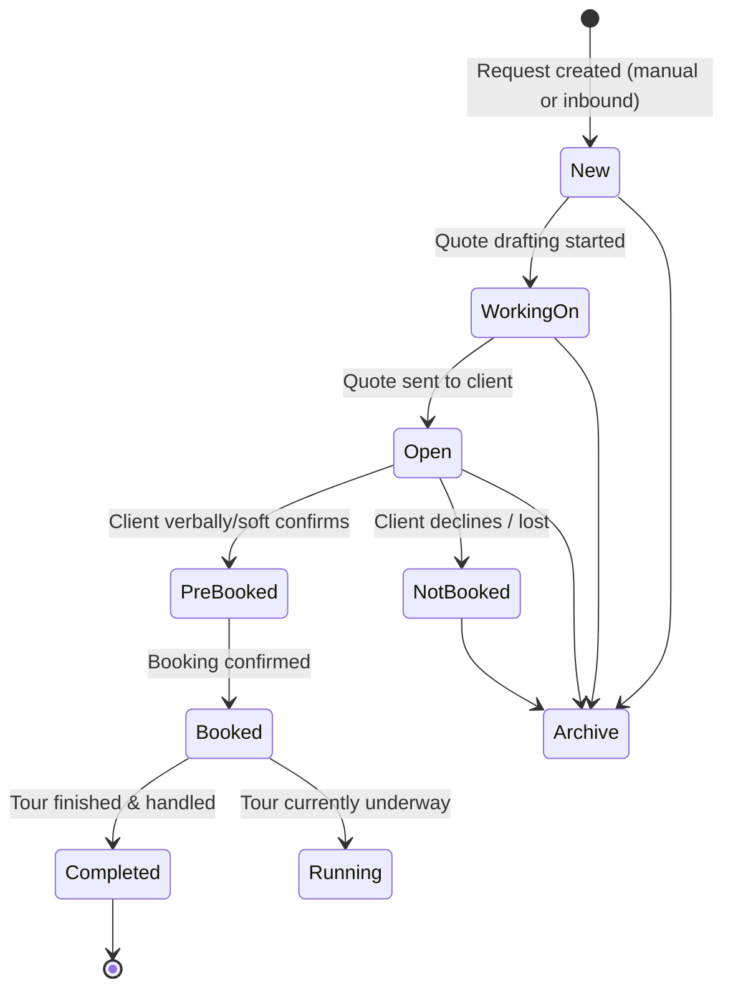
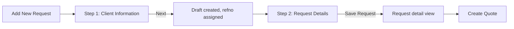
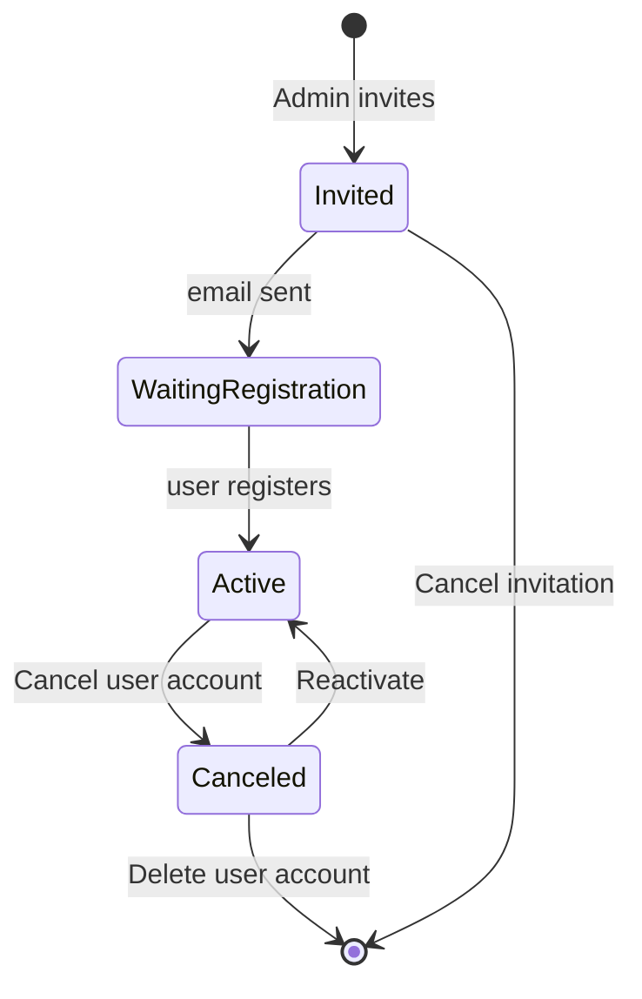

# 2. User Flows

Each flow lists **Trigger → Steps → Validation → Success → Error → Edge cases**. Diagrams use Mermaid.

## 2.0 Master lifecycle


Status semantics (from tab tooltips): **New** = new requests; **Working On** = requests with quotes being drafted; **Open** = sent but open quotes; **Pre-Booked**; **Booked**; **Completed** = fully handled after booking; **Not Booked** = lost; **Archive** = archived; **Running Tours** = currently underway.

---

## 2.1 Login / Authentication
- **Trigger:** visit any app URL while unauthenticated → redirect to `/signin`.
- **Steps:** enter email + password → submit (multipart POST `…/internal/v1/signin`) → on success, bearer/refresh tokens established → redirect to `/requests`.
- **Validation:** email format; required fields; server verifies credentials.
- **Success:** 200 with token; app bootstraps reference data (`/versions`, `/search/*`, `/labeloverrides`) into localStorage; lands on Requests board.
- **Error:** 401 `{success:false, error, error_msg, error_code}`; observed a 401→200 retry pattern (first attempt rejected, second succeeds — consistent with a challenge/second-factor or token-priming step). Invalid credentials keep the user on `/signin` with an inline error.
- **Edge cases:** per-user **2FA** (TOTP) can gate login; expired session → 401 "Token missing" on API calls → forced re-auth; "remember me"/persistent session via `apitoken` cookie.

## 2.2 Registration / Onboarding
- **Trigger:** an Admin invites a user from `/users`; invitee receives email.
- **Steps:** invitee follows invite link → sets name/password → account becomes Active.
- **Validation:** invitation token validity; password policy; unique email.
- **Success:** user appears in `/users` as *Active*.
- **Error:** expired/again-needed invite → "Waiting for Registration" state with *Resend invitation or update email address*.
- **Edge cases:** self-serve signup exists at the marketing site (out of scope); seat limits (Free plan = 2 accounts) block new invites until upgraded.

## 2.3 Dashboard / Landing (Requests board)
- **Trigger:** login or click *Requests*.
- **Steps:** board shows status tabs with counts; a table/cards list of requests for the active tab; **Handled by** filter (All / each user / Unassigned) and **Sort by** (per tab: Date received / Start date / Last edit / Date last sent quote / Date booked / …); free-text **Search request** (server autocomplete, min 2 chars, param `q`).
- **Validation:** search min-length 2.
- **Success:** filtered/sorted list; each row shows client, tour, travelers, travel date, value, tasks progress, quote status.
- **Error/empty:** friendly empty state per tab (e.g. "No New Requests." with a link to add one).
- **Edge cases:** archived requests hidden unless on Archive tab; counts update live after status changes.

## 2.4 Create Request (CRUD - Create)

- **Trigger:** *Add New Request* (`#add`).
- **Steps:** *Step 1 Client Information* — communication language, email*, last name*, first name, salutation, country, phone, lead source; or *Select existing client*. Clicking **Next** persists a draft and assigns a **reference** (`YYYY-NNNN`, e.g. 2026-0029). *Step 2 Request Details* — tour title, type, length, countries visited (Kenya/Tanzania), start/end destination, start date, travelers (group type × amount rows), standard room settings rows, request info/notes. **Save Request**.
- **Validation:** email required + format; last name required; Step 2 gated until Step 1 valid.
- **Success:** request lands in **New** (or **Working On** once a quote exists); editable ref/date/source inline.
- **Error:** server validation returns the envelope error; inline field errors.
- **Edge cases:** refno auto-increments per tenant numbering config; "Select existing client" links `clientid` and pre-fills; a request can start with zero tour details.

## 2.5 Read / Update / Delete a Request
- **Read:** click a row → detail with sub-tabs (Request Information, Quotes, Tour Information, Tasks, Notes). Booking view adds Travelers, Flight Info, Responsible User, Assigned Tour Staff, Used Vehicles.
- **Update:** inline *Edit* links per section (`actions.requestref()`, `actions.requestdate()`, `actions.requestsource()`, handled-by, client info, tour details, travelers, rooms); status transitions via `requests.setBooked/setPrebooked/setNotBooked(id)`.
- **Delete:** *Delete request* is **disabled once any quote exists** ("Only requests without any quotes can be deleted. Please archive the request if required."). *Archive request* is always available and prompts a confirm modal.
- **Validation:** delete guarded by quote-existence; archive confirmation required.
- **Success:** archived request moves to Archive tab; deleted request removed entirely.
- **Error:** attempting delete with quotes → action disabled with tooltip.
- **Edge cases:** archived requests optionally included in Insights via an "Include archived requests" toggle.

## 2.6 Build a Quote (core flow)
```mermaid
flowchart LR
  S[Create Quote /quote/new/{req}/start] --> D[day-by-day]
  D --> P[pricing]
  P --> V[preview & edit]
  V --> F[finish]
  F --> PDF[Generate PDF]
  F --> DIG[Publish Digital page]
  F --> SEND[Send to client]
```
- **Trigger:** *Create Quote* on a request → creates `quote_id`, opens `day-by-day`.
- **Steps:**
  1. **Day-by-day** — build the itinerary day cards: select countries, add accommodation, **+ Add Activities (per day)**, **Add drinks & other options**, **Set meal plan per day**, plus **Copy day / Clear day / Delete day / Add day before / after / Add day**. Accommodation/activity/destination pickers pull from the shared Accommodations DB + Content Library.
  2. **Pricing** — positions/rates derived from itinerary; margins, currency, per-person pricing; "Add Missing Positions".
  3. **Preview & Edit Text and Images** — edit descriptive copy and imagery; *Preview Digital Page*; *Edit Day X to Y*.
  4. **Finish** — generate PDF, publish Digital page, and send to client; produces a **version** `refno.N` (e.g. 2026-0019.1).
- **Validation:** Pricing requires a non-empty itinerary (else 500). Days must have at least the minimum content to price.
- **Success:** quote reaches *Draft → Sent*; PDF at `{tenant}.safarioffice.app/{hash}.pdf`, Digital at `/{hash}/online`; request moves to **Open**.
- **Error:** "Something Went Wrong" if a step is entered out of order or state is incomplete.
- **Edge cases:** multiple quote versions per request (config: *Quote Version per Request*); templates can seed a quote; a booked quote is marked *Confirmed* with a date.

## 2.7 Convert to Booking
- **Trigger:** *Booked* action on an Open/Pre-Booked request (or from the quote).
- **Steps:** set status Booked → booking view shows Total Booking Value, confirmed version, tasks checklist (e.g. 0/17), travelers, flights, responsible user, tour staff, vehicles.
- **Validation:** typically requires an accepted quote/version.
- **Success:** appears in **Booked**; running tours surface under **Running Tours** during travel dates; **Completed** when handled.
- **Error:** status revert available (Pre-Booked/Not Booked).
- **Edge cases:** SafariBuddy add-on offers a traveler app for booked trips (upsell).

## 2.8 Search
- **Global request search:** server-mode autocomplete (`data-source=searchreq`, param `q`, min 2). Returns matching requests.
- **Clients search:** `GET /internal/v1/clients?page=&search=` — server search + pagination.
- **Accommodations search:** free text "Search Accommodation or Destination" + geo radius (5–200 km) around an anchor.
- **Autocompletes everywhere:** bound via `data-source` to cached `search_*` datasets (client-side filter) or server sources.
- **Edge cases:** min-length gating; "skipadd" fields disallow ad-hoc values; some fields allow adding new custom values (they persist to the tenant's dataset with a version bump).

## 2.9 Filters, Sorting
- **Requests:** *Handled by* filter; per-tab *Sort by* options; search.
- **Accommodations:** faceted filters (Countries, Accommodation Type, Class Type, Services, Facilities, Room Amenities, Room Types, Location), geo radius, tabs (All / My Favorites / Premium Listings), Sort (Default / My Favorites first / Name A-Z), List/Map view, Clear All. Filter state persisted as base64 in URL hash.
- **Content Library:** filter tabs *With Content / Without Content / Archived*.
- **Insights:** date-range (Last 365/90/30 days, All time, year, year+month) + handled-by user.
- **Validation/edge:** empty filter → full list; incompatible facets simply narrow results; map view requires geocoded properties.

## 2.10 Export (PDF / Digital proposal)
- **Trigger:** *Finish Quote*, or PDF/Digital links on a booking.
- **Steps:** server renders a branded PDF and an interactive digital page to the tenant delivery subdomain.
- **Success:** shareable URLs; opens/last-sent tracked (sort options reference "Date last opened", "Date last sent quote").
- **Error:** generation failure surfaces an error toast/page.
- **Edge cases:** *Share Tours* add-on and multi-language (*Language Pack*) affect output; versioned filenames.

## 2.11 Import
- No bulk data-import UI observed for requests/clients. The closest import surfaces are **Content Library upload** (`/contentlibrary/upload/{type}`) for media/content and selecting from the shared **Accommodations** database (effectively importing property data into a quote). *Recommendation for the rebuild:* add CSV import for clients and an inbound-email/webhook request intake.

## 2.12 Notifications
- **Trigger:** system events (e.g., a request assigned/received).
- **Steps:** user configures **Notification Settings** on `/profile` (e.g., "Notify me by email when a request has been …").
- **Success:** email notifications sent per preferences.
- **Edge cases:** Gleap widget provides in-app support messaging/feedback (separate channel); no evidence of a global in-app notification center beyond email prefs.

## 2.13 Settings
- **Profile** (`/profile`): personal details, avatar, password change, personal signature, 2FA enable/disable, notification prefs, account progress meter.
- **System Settings** (`/settings`): currencies, default currency, date format (long/short), first day of week, reference **prefix / numbering / starting number**, "Letters of Last Name" (refno composition), **Quote Version per Request** scheme.
- **Company** (`/company`): contact information. **Billing** (`/billing`). **Subscriptions** (`/subscriptions`).
- **Validation:** password change requires old password; 2FA enable requires password + TOTP code.
- **Edge cases:** settings are tenant-wide (affect all users); currency/date formats drive quote rendering.

## 2.14 User Management

- **Trigger:** Admin opens `/users`.
- **Steps:** view seats (Free = 2), invite/manage accounts; columns: Nr., User Account, Account Type (Admin / No Access / User), Activity (last sign-in, invited state), Status (Active, 2FA state, Canceled), Manage (cancel/undo/reactivate/delete/cancel invitation).
- **Validation:** seat limits; only Admin can manage; email uniqueness.
- **Success:** account state transitions reflected immediately.
- **Edge cases:** *No Access* = deactivated seat; per-user 2FA status shown; last sign-in surfaces stale accounts.

## 2.15 Billing / Subscription
- **Trigger:** `/billing`, `/subscriptions`, `/addons`.
- **Steps:** view current plan (Free), manage subscription, add billing info, activate add-ons (Language Pack €24.99, SafariBuddy €34.99, Share Tours €19.99, Content Library free) with 14-day trials.
- **Validation:** payment details required to activate paid add-ons; T&C acceptance.
- **Success:** add-on becomes available to all users of the company.
- **Edge cases:** trials auto-convert; plan gates features (unlimited Content Library storage requires PRO; extra seats require upgrade).

## 2.16 Reports (Insights)
- **Trigger:** *Insights* (via "…" menu).
- **Steps:** choose date range + handled-by; view KPIs and a source chart.
- **Metrics:** Received Requests, Requests per Source (Top 3), Sent Quotes (and clients quoted), Average Days to Booking, Average Quote Value, Confirmed Bookings, Quote Conversion to Booking (%), Average Booking Value, Total Booking Value.
- **Edge cases:** option to include archived requests; per-user breakdown; sparse data shows zeros.

## 2.17 Profile management
- Covered in 2.13; plus **Personal Signature** (used in quote/emails) and **Account Progress** (onboarding completeness meter, e.g. 95%).

## 2.18 CRM — Clients
- **Trigger:** *Clients* (via "…").
- **Steps:** paginated table (Full name, Email, Phone, Country, Requests count) with search; **Add a Client**; per-row **Edit client information** / **Delete**.
- **Validation:** client email; delete likely guarded if linked to requests.
- **Success:** client CRUD; a client links to many requests.
- **Edge cases:** duplicate detection not evident (rebuild should add it); client is auto-created during Add-Request if new.
