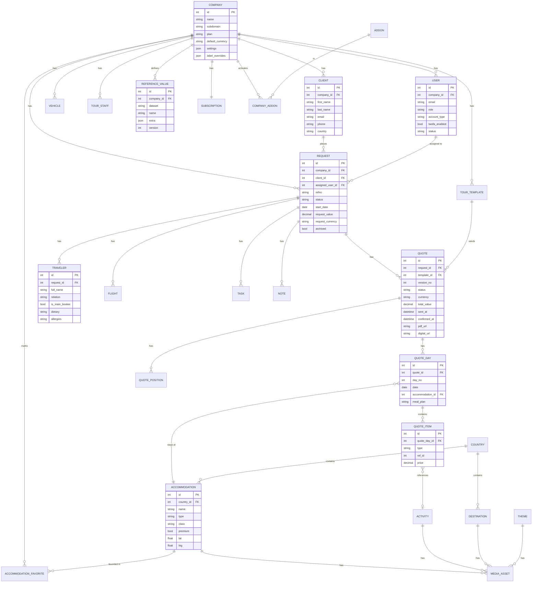

# 5. Data Model

Inferred from API payloads (`network/req-*-list.json`, `versions.json`, `labeloverrides.json`), DOM `data-name` attributes, URL/id patterns, and the ~45 `search/*` reference datasets. Field names marked *(inferred)* are reconstructed.

## 5.1 Confirmed field evidence
**Request (list payload):** `request_id`, `cr_date`, `update_date`, `status` (`new|working|open|prebooked|booked|completed|notbooked`), `refno` (`YYYY-NNNN`), `request_value`, `request_currency`, `archived`, `name`, `email`, `country`, `phone`, `template_name`, `quotetemplate_id`, `firstname`, `user_id`, `avatar`, `sent_quotes`, `draft_quotes`, `status_update`, `start_date`, `end_date`, `booked_date`, `tasks_done`, `assigned`, `last_sent`, `confirmed`. (List responses also embed pre-rendered HTML snippets for tasks/tour/group/traveldate/value — a rendering optimization, not schema.)

**Quote/version:** composite id `{request_id}-{quote_id}`; version label `refno.N` (e.g. `2026-0019.1`); states draft/sent/confirmed; sent & confirmed dates; PDF + digital URLs on `{tenant}.safarioffice.app`.

**Client:** full name, email, phone, country, salutation, requests count.

**User:** id (e.g. 6316), first/last name, email, role, avatar, account type (Admin/No Access/User), 2FA state, last sign-in, invite/active/canceled lifecycle.

**Reference data (enums/lookup tables), cached with a `versions` map:** salutation, countries, destinationcountries, leadsource, linktracking, tourtype, tourlength, theme, group, room, meal, moment (time-of-day), option, optionbook, optionunit, optionaltunit, package, pricing (age tiers), inclusion, exclusion, tccategory (T&C), association, availabilities, classtype, vehicle, vehicletype, companyvehicles, role, tasktype, taskstatus, relationtobooker, dietary, allergies, airlines, airports, transfertime, doctypes, attachmentcategory, templatestatus, notbooked (reasons), acco_contact_subject, activity, accommodations, destinations.

**White-label term overrides (`labeloverrides`):** client(s), options, proposal(s), request(s), summary, upgrades — tenant-customizable UI labels.

## 5.2 Core entities

| Entity | Key fields | Notes |
|---|---|---|
| **Company/Tenant** | id, name, subdomain, plan, default_currency, date formats, first_day_of_week, refno prefix/numbering/start, quote_version_scheme, label_overrides | multi-tenant root; owns delivery subdomain |
| **User** | id, company_id, first/last name, email, role, avatar, account_type, twofa_enabled, status, last_sign_in_at, invited_at | Admin/User/No-Access |
| **Client** | id, company_id, salutation, first/last name, email, phone, country, lead_source | CRM record; 1→many requests |
| **Request** | id, company_id, client_id, assigned_user_id, refno, status, source, cr_date, start_date, end_date, booked_date, request_value, request_currency, tour_name, tour_type, tour_length, countries[], start/end_destination, archived | pipeline core |
| **Quote** | id, request_id, version_no, status(draft/sent/confirmed), language, currency, total_value, sent_at, confirmed_at, pdf_url, digital_url, template_id | many per request |
| **QuoteDay** | id, quote_id, day_no, date, country_id, accommodation_id, room_type, meal_plan, notes | itinerary day |
| **QuoteItem** | id, quote_day_id, type(activity/transfer/option/meal/accommodation), ref_id, title, description, qty, unit, price, currency | day contents |
| **QuotePosition** | id, quote_id, label, category, qty, unit_cost, margin, sell_price, currency | pricing line |
| **Traveler** | id, request_id, full_name, relation, is_main_booker, age/dob, dietary, allergies | pricing tiers via age |
| **Flight** | id, request_id, airline, flight_no, from_airport, to_airport, depart_at, arrive_at, travelers[] | |
| **Task** | id, request_id, type, status, due_date, description, done | checklist (e.g. 0/17) |
| **Note** | id, request_id, author_id, body, created_at | |
| **TourTemplate** | id, company_id, name, status(draft/ready), last_edit_by, locked, content(days/pricing) | reusable itinerary; copy/lock/share |
| **Accommodation** | id, name, country_id, type, class, facilities[], amenities[], room_types[], location(lat/lng), premium, is_global | shared global DB + tenant favorites |
| **AccommodationFavorite** | company_id, accommodation_id | |
| **Activity** | id, company_id/global, name, country_id, destination_id, description, media | content library |
| **Destination** | id, name, country_id, type(City/Airport/Park), description, media(images/covers/videos) | |
| **Theme** | id, company_id, name, description, media | |
| **Country** | id, name, iso | (Kenya=2, Tanzania=5 for this tenant) |
| **Vehicle** | id, company_id, name, type, seats | company fleet |
| **TourStaff** | id, company_id, name, role, phone, email | guides/drivers/etc. |
| **MediaAsset** | id, owner_type, owner_id, kind(image/cover/video), url, storage_bytes | storage quota per plan |
| **Subscription** | id, company_id, plan, status, seats, renews_at | |
| **Addon** | id, slug, name, price, currency, trial_days | catalog |
| **CompanyAddon** | company_id, addon_id, status, trial_ends_at | activations |
| **ReferenceValue** | id, company_id(nullable=global), dataset, name, extra(json), version | powers all `search/*` |
| **Audit/Activity** | id, entity, entity_id, user_id, action, at | (implied by cr_date/update_date/last_opened) |

## 5.3 Enumerations (status/enum values)
- **Request.status:** `new, working, open, prebooked, booked, completed, notbooked` (+ `archived` flag, + derived `running`).
- **Quote.status:** `draft, sent, confirmed`.
- **TourTemplate.status:** `ready` (Ready for use), `draft`.
- **User.account_type:** `admin, user, no_access`; **User.status:** `invited, waiting_registration, active, canceled`.
- **Task.type:** Follow up, Accommodation, Activity, Payment, Document, Other. **Task.status:** To do, Sent, Received, … (type-dependent).
- **Pricing tiers:** Adult, Child 12–18, etc. (`search_pricing`). **Destination.type:** City, Airport, Park.
- **Currencies/date formats/first-day-of-week:** tenant-configurable enums.

## 5.4 Relationships (prose)
A **Company** has many Users, Clients, Requests, TourTemplates, Vehicles, TourStaff, ReferenceValues, one Subscription, and many CompanyAddons. A **Client** has many Requests. A **Request** belongs to a Client and an assigned User, and has many Quotes, Travelers, Flights, Tasks, Notes. A **Quote** has many QuoteDays (each with QuoteItems) and QuotePositions, and may derive from a TourTemplate. **QuoteDay** references an Accommodation; **QuoteItem** references Activities/options. **Accommodation/Activity/Destination/Theme** are content entities (some global/shared, some tenant-owned) with many MediaAssets. Global **Accommodation** records can be favorited per Company.

## 5.5 Timestamps & identifiers
- Timestamps: `cr_date`, `update_date`, `status_update`, `booked_date`, `sent_at`, `confirmed_at`, last_opened/last_sent (tracking). Use `created_at/updated_at` + domain-specific timestamps in the rebuild.
- Identifiers: numeric surrogate PKs (`request_id`, `quote_id`, `user_id`, `country_id`, `airport_id`, `vehicle_id`, `cacid` for custom reference values). Human ref: `refno` (`{prefix}{YYYY}-{seq}`) with tenant numbering config; quote version `refno.N`.

## 5.6 ERD

