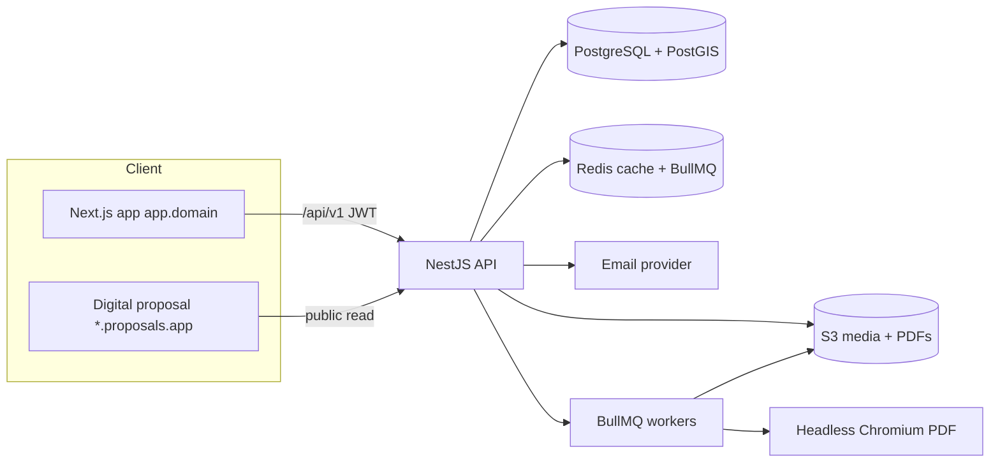

# Technical Specification — Next.js + NestJS + PostgreSQL

## 1. Architecture overview

- **Two frontends, one API.** The operator app (authenticated) and the public digital-proposal renderer (per-tenant subdomain, read-only) both call the NestJS API.
- **Stateless API** behind a load balancer; **workers** handle PDF generation, email, and imports via Redis/BullMQ.

## 2. Multi-tenancy
- Single database, **`company_id` on every tenant-owned table**, enforced by a NestJS **TenantGuard** + Prisma middleware that injects `company_id` into every query.
- **Shared/global tables** (accommodations, countries, airports, global destinations/activities) are readable across tenants; tenant overlays via `*_favorite`/`company_*` link tables.
- **Subdomain resolution:** operator app on `app.domain`; published proposals on `{tenant-slug}.proposals.app` resolved by middleware → tenant → public quote by hashed slug.

## 3. Auth & authorization
- **JWT access token** (15 min, httpOnly cookie) + **rotating refresh token** (7–30 days, httpOnly, reuse-detection). CSRF via double-submit for cookie auth.
- **TOTP 2FA** with recovery codes.
- **RBAC:** roles `owner|admin|member|viewer`; capability checks via a `@Roles()`/`@Can()` decorator + guard. `no_access` = disabled seat.
- All list/detail queries tenant-scoped; public proposal endpoints are unauthenticated but scoped by hashed quote slug.

## 4. Domain modules (NestJS)
`auth`, `companies`, `users`, `clients`, `requests`, `quotes` (day-by-day, pricing, publish), `bookings`, `travelers`, `flights`, `tasks`, `notes`, `templates`, `accommodations`, `content` (destinations/activities/themes/countries/vehicles/tourstaff/media), `reference` (enums + versions), `insights`, `settings`, `billing`, `addons`, `notifications`, `files`.

## 5. Reference-data & caching strategy (mirrors observed design)
- `GET /reference/versions` → `{dataset: version}` map.
- `GET /reference/{dataset}` → values; client caches in localStorage keyed by version; refetch only when version changes.
- Custom tenant values POST to `/reference/{dataset}` and bump the dataset version.
- Server-side: cache reference queries in Redis; ETag/`Cache-Control` on read endpoints.

## 6. Quote builder & pricing
- **Data:** `Quote → QuoteDay[] → QuoteItem[]` plus `QuotePosition[]` for pricing lines.
- **Pricing engine:** money as integer minor units + currency; per-position `unit_cost`, `margin`, `sell_price`; per-person tiers (adult/child bands from `pricing` reference); totals recomputed server-side (never trust client).
- **Gating:** pricing requires ≥1 day with content; publish requires priced positions.
- **Versioning:** each publish increments `version_no` → `refno.N`; prior versions retained.

## 7. Publishing (PDF + digital)
- **Digital proposal**: a Next.js public route renders the quote from the API (SSR, responsive, tenant-branded).
- **PDF**: a worker loads the same digital template in headless Chromium and prints to PDF; both stored in S3; URLs `…/proposals/{hash}.pdf` and `/{hash}` (digital). Track `opened_at`/`sent_at`.

## 8. Accommodations & geo
- PostGIS `geography(Point)`; **radius search** `ST_DWithin(location, anchor, radius_km*1000)`; facet filters via indexed columns/join tables; list + map (MapLibre) views; per-tenant favorites and premium flags.

## 9. Files & storage
- Presigned S3 uploads; per-tenant storage accounting (`MediaAsset.storage_bytes`) with plan quotas; image variants via CDN.

## 10. Notifications & jobs
- BullMQ queues: `pdf`, `email`, `import`, `thumbnails`. Email templates for quote-sent, request-assigned, invitations. In-app support widget (optional).

## 11. Observability & security
- Sentry (errors), OpenTelemetry traces, structured logs; perf headers analogous to `x-render-time`.
- Secrets in a vault; rate limiting; input validation (class-validator/zod); audit log of mutations & status changes.

## 12. Environments & CI/CD
- `dev/staging/prod`; Prisma migrations; seed scripts for reference data + demo tenant; GitHub Actions (lint/test/build/migrate/deploy); preview deployments for web.

## 13. API contract
REST under `/api/v1` with the success/error envelope from [../06-api.md](../06-api.md); see [openapi.yaml](openapi.yaml).

## 14. Key technical risks & mitigations
- **Accommodations dataset sourcing** → ingestion pipeline + manual curation + tenant contributions.
- **PDF fidelity** → single shared template for digital+PDF; visual regression tests.
- **Money/rounding** → integer minor units, `decimal` in DB, currency-aware formatting.
- **Tenant leakage** → enforce scoping in middleware + integration tests that assert cross-tenant 404.
